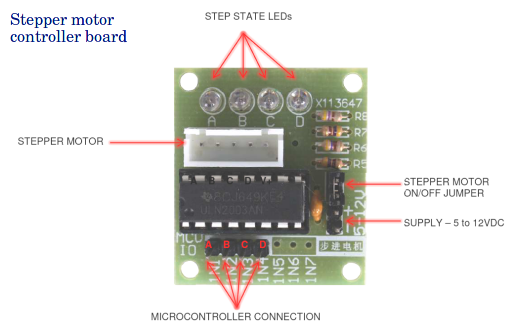
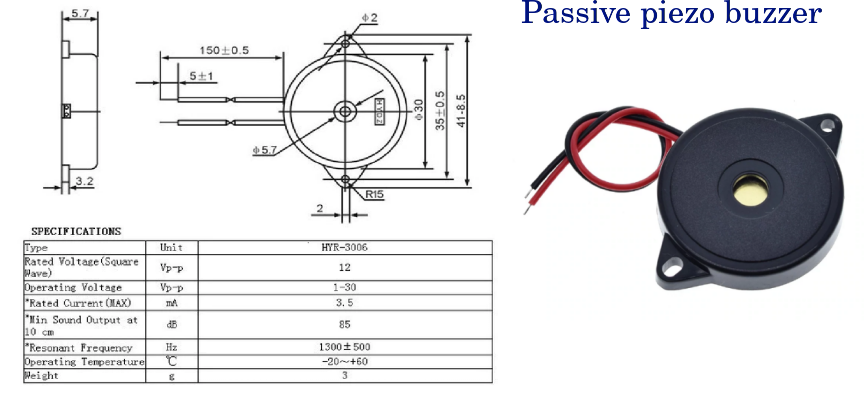
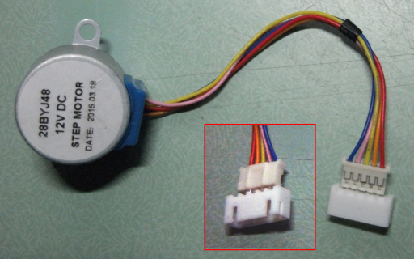
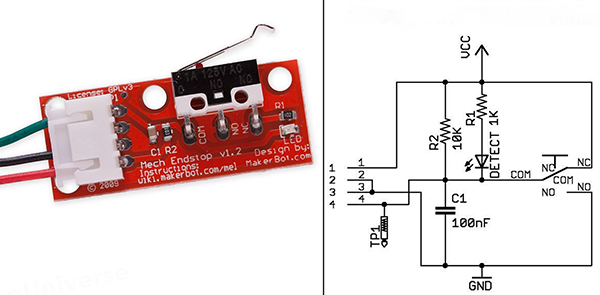

PUMA Project: Control Console Specifications and How To Guide
=============================================================

This project is released under the following licenses:

For source code (including CAD files, STL files and computer programs) and compiled code: the GNU GENERAL PUBLIC LICENSE Version 3

For documentation: the GNU Free Documentation License, Version 1.3

Introduction
------------
The PUMA Control Console (PCC) is the device which lets the user control the Z-motor, lamp brightness and TFT displays of the spatial light modulator (SLM) and head-up-display (HUD). A detailed illustrated user manual explaining the hardware and software is available here: [PUMA Control_User_Manual](../../Software/PUMA_Control/PUMA_Control_Manual.pdf)  
A single PCC can only control one TFT device at a time so can only control the HUD or a SLM at any one time.
If all you need is electronic control of the microscope lamp and nothing else then the PCC is overkill. I recommend you use the PUMA Lite console instead which is much easier to build (see the relevant section of the GitHub page for details on the PUMA Lite console).
The PCC uses generic parts that are widely available with the exception of the custom PUMA motherboard. However the motherboard can be made as a DIY project (see the relevant section of the GitHub repository for details on how to make a PUMA motherboard).
A video tutorial was made which shows how to construct the PCC. This 'How To' guide gives details of the materials tools and components you need but only sparse assembly instruction - see the video for a more comprehensive illustrated construction guide.

Required Components
-------------------
* The following 3D printed parts as specified in the 'PUMA_3D_Printing_Guide':
    1. All parts in the chapter 'PUMA Control Console'
    2. The part 'PL_Knob.stl' from the 'PUMA Lite' chapter.
* The following pre-assembled PCBs:
    1. PUMA Motherboard
    2. Arduino Nano v.3 microcontroller
    3. ULN2003 stepper controller board (for a 28BYJ48  motor) of the type shown in the below picture.
    
    4. XL4015-based DC-DC step-down buck converter module with both current and voltage regulation of the type shown in the below picture.
    
    5. 5-way joystick navigation button controller for Arduino with two additional push buttons of the type shown in the below picture.
    
* A passive piezoelectric sounder buzzer: AT3040 type with a 30 mm diameter, 5.5 mm high enclosure. The enclosure to have two 2 mm fixing holes 35 mm apart. Specifications as shown in the below picture:

* Solder
* Insulated power cable  about 30 to 50 cm long in total. Two connecting wires in this cable (one for positive and one for ground). There is no need for it to be coaxial or shielded. Speaker figure of 8 cable can be used (outer dims ~2.2x4.4 mm, inner core 8 strand copper conductor).
* Phono socket panel mount type
* JST XH double headed connector cables and PCB headers. The cables 20 cm long each. right angled versions of the headers should be used. Examples of the following pin numbers are required: 2 (3 of these), 3, 4 (at least 2), 5, 7, 8 (at least 2)
* Through hole resistor: 5 Ohm, 1%, 1W, Axial
* Precision potentiometer 200 ohm: Wire wound, bushing mount, Bourns 3590s type.
* ON/Off rectangular rocker switch, 10A/125V or 6A/250V, SPST type. Dimensions: Flange (2.05 cm x 1.5 cm), body size (1.8 cm x 1.15 cm) with 0.48 cm wide connector lugs. Switch body height below flange 1.05 cm and connector lug height 0.85 cm.
* Two of 9v PP3-type battery snap connectors with 150 mm leads
* A power supply: Either two 9v batteries (type 6LR61 PP3) or a mains regulated power adapter that can put out 7 to 9 volts regulated DC and at least 1 amp of current with a PP3 connector.
* Solderable spade connectors with insulator covers of sizes 4.8 mm and 2.8 mm (widths).
* Electrical insulation tape.
* Scissors

Additional Peripherals Required for Testing
-------------------------------------------
* ST7789 240x240 pixel TFT display unit of the kind that will work on 5 volts power and signal supplies (NOT the 3 volt only version - these will not take the 5 volts that the PCC puts out and they will be permanently destroyed if used).
* 12V stepper motor of the 28BYJ48 type. These may come with a JST PH connector in which case you will need to adapt the connector to fit JST XH cables e.g. by adding JST XH PCB header to the motor JST PH as shown in the picture below.

* Makerbot type endstop limit switch with its cable (customised to fit a 3 pin JST connector as described in the 'How To' document for the PUMA Motherboard. The type of limits switch is as shown below.

* A PUMA microscope LED lamp module

Fixtures and Fittings
---------------------
* All screws are of Allen socket type and made of stainless steel
* The case screws are countersunk. All other screws are socket cap screws.
* The number and type of screws used for each component are given below starting with the component they are to be used for. Lengths refer to the length of the threaded part of the screws (i.e. it does not include the head / socket).
* Case screws: 8x M3, 12 mm long
* Power board: 4x M2, 6 mm long
* Piezo buzzer: 2x M2, 8 mm long
* Motor board: 3x M3, 6 mm long
* Motherboard: 3x (for DIY) or 4x (for PCB) M3, 6 mm long
* Joystick clamp: 1x M3, 5 mm long with an M3 flat form washer
 
Tools
-----
* Wire cutters and wire strippers
* Long nose pliers
* Soldering iron, sponge, stand and fume extractor
* Allen keys (2 mm and 2.5 mm)
* Small Philips head screwdriver
* Multimeter with voltmeter and ammeter capabilities (to more than 1 amp tolerance)

Assembly Procedure
------------------
* See the video tutorial for detailed illustrations.
* Pre-thread all holes in the casing that are designed to take the thread of a screw. Don't go all the way in and be especially careful of the shallow holes on the front panel otherwise you could deform the external surface or go all the way through with the screw.
* Attach the components to the front compartment. Attack the JST cable to the joystick board then bend this down 45 degrees. Insert the joystick board into its location ensuring it clips over the 4 pegs in the case. Secure the joystick clamp at its threaded end over the joystick.
* Cut a double-headed JST 2-pin cable in half and strip the bare ends for a few mm then connect them to the piezo buzzer with solder and cover this with electrical insulation tape. The connection is made such that the red wire of the buzzer goes to pin 2 of the JST connector.
* Fix the piezo buzzer over the other end of the joystick clamp with its two M2 screws.
* Now we turn our attention to the 200 Ohm lamp brightness control potentiometer. Before fitting this I recommend you bend the end connector to 45 degrees and solder the middle connector to its connecting cable. This connecting cable is made from two components. One is a 10 cm long piece of ordinary insulated wire and the other is a 5 ohm resistor that is soldered to the end of the wire. The other end of the resistor is bent into a loop ready to fit to the power board as we’ll discuss shortly. This resistor is an essential component for safety and controllability of the lamp, so don't skip it.
* Now fix the potentiometer into the front of the casing with its terminals facing up. Note that the hole has flattened regions as does the thread on the bushing so you must site the potentiometer accordingly. Place the fixing washer over the bushing and finally the hex nut. Once the nut is tightened you can add the user-control knob.
* The final item for the front compartment is the motor control board and this is fixed to the wall of the mid-section with these three M3 screws, each 6 mm long.
* Once in place, fix the connecting cables to the motor board. The output cable is a 5-pin cable that goes into this JST connector here and you should bend this down and route it underneath, through the bottom slot in the casing, to the back compartment prior to fixing the motherboard in place. The motor power cable is a 2-pin JST cable that goes on the two power pins of the motor board. The correct orientation is to insert the connector over the pins with the lugs of the JST connector facing *towards* the ULN2003 control chip. Now because this is a 2-pin connector and the piezo buzzer also has a 2-pin connector it’s a good idea to mark the motor connector to distinguish the two. 
* Finally for the front compartment, connect a 4-pin JST cable to the inputs to the ULN2003 control chip and the correct orientation is to insert the cable with the JST lugs facing *away* from the chip.
* We now turn to the lamp power supply (the XL4015-based DC buck converter) which goes into the top part of the mid-compartment. Before fitting the board we need to set the regulated outputs correctly to avoid doing damage to the bulb. To do this, apply a power source to the input pins and get an ammeter and set it to measure up to 20 amps. Apply the ammeter to the output and adjust the current trimmer on the buck converter board – the one closest to the output end of the board – until the current displayed on the meter is 0.33 Amps (i.e. 330 mA).
* Next disconnect your ammeter and change over to a volt-meter measuring in the range of up to 20 volts. Apply the volt meter to he output and adjust the voltage trimmer until the reading is 5.00 volts. 
* The unit is now correctly set, but before we insert it we need to attach the output cables to the board because there’s not enough room to fit them once it’s in place. The output cables are made up in such a way as to connect the output from the board to 3 things:
    1. to the lamp output socket of the console, 
    2. to the lamp brightness potentiometer and also
    3. to the motherboard to enable the continuous monitoring of lamp current. 
* We achieve that connectivity in the following way: Take half a 2-pin JST connector and connect pin 1 directly to the negative / ground output of the power board and this negative output is also connected directly to the lamp output phono socket by a 13 cm long wire with a 4.8 mm spade connector at one end. The other pin of the JST connector is also connected directly to the lamp output phono socket (to the positive terminal this time) by a 20 cm long wire which is marked with a white stripe and also has a 4.8 mm spade connector at one end. In addition, the same pin is also connected to the end connector of the brightness potentiometer by means of a 2.8 mm spade connector but it is not connected to the power board. Instead, the positive output of the power board is connected to the middle lead of the potentiometer by means of the 5 Ohm resistor cable we described earlier (and so the connection to the positive terminal of the lamp and lamp meter are made via the variable resistance of the potentiometer plus the fixed 5 ohm resistor). So connect the looped end of the 5 Ohm resistor to the positive output terminal of the power board. 
* Attach the input cable to the power board by again using half a 2-pin JST cable. For the input, pin 1 connects to the positive terminal.
* We can now insert the power board into the central compartment. To do this first insert all 4 M2 screws through the holes in the board and lift the board as you insert it so that the bottom of the screws don't snag of the risers. Then lower the board into position and fix the screws in their holes.
* We now come to attaching the motherboard in the posterior compartment but before we do that we should first connect the joystick cable to the motherboard because it would be very difficult to do so once the board is in place. Now fix the motherboard to its risers its M3 screws.
* With the motherboard in place we can start to route and connect the cables to it from the front and middle compartments. Connect everything except the main power input to the board. See the Tripad or PCB diagram in the 'Motherboard' 'How To' document for details of what connects where.
* Now prepare the back panel so we can complete the connections. The back panel contains the main power on/off switch and the phono connector that we use as a power output socket for the lamp of the microscope. First bend the pins of the on/off switch to 45 degrees to ensure the connectors fit in the limited space available. Now insert the switch into its rectangular hole in the 3D printed back panel and press down until it clicks in place. Ensure the switch is inserted with the pins bent *away* from the phono connector hole.
* Now insert the outer washer of the phono connector into the round hole from the external aspect then push the main body of the phono connector in. Now from the inside insert the connector washer. Insert the locking nut and tighten it well. Finally, place the small 3D printed M5-type plastic washer over the central connector. This is important to prevent the central spade connector from short-circuiting by touching the negative conducting areas around it. You may need to flatten the the central connector a little with the long nose pliers and this helps retain the plastic washer until we connect the spade connector over it later on.
* Now connect the main power internal connection cables. To do this prepare a set of connected wires by starting with the two 9V battery connectors with their leads joined in parallel – red to red and black to black. Prepared half a 2-pin JST connector cable and connect its free ends as follows: Pin 1 is connected directly to a 4.8 mm spade connector and this goes to one pole of the on-off switch (it doesn't matter which pole). The positive ends of the battery connectors are soldered to another 4.8 mm spade connector and this is connected to the other pole of the on/off switch. Thus when the user closes the switch the positive lead of the input power will be connected to pin 1 of the JST connector. The negative ends of the input power cable are soldered directly to pin 2 of the JST connector.
* Now that you have this power cable arrangement simply insert the power JST connector into the remaining JST plug on the motherboard and pass the battery connectors into the battery compartment area ensuring that their cables are inserted into the grooves in the wall of the cases.
* Complete the wiring by connecting the output lamp spades to the phono connector with the wire coming directly from the lamp brightness potentiometer being connected to the central (positive) terminal. To keep these wires from blocking the Arduino reset pin and power indicator route them around the USB port.
* Ensure all spade connections are tight – crimp them with long nose pliers if they are loose.
* You are now ready to close the case. Push excess cable from the back to the front compartment (because there is more room in the front to accommodate them) and ensure all cables lie in their recessed channels. Then close the front compartment and fix it in place with the countersunk case screws. Next likewise close and secure the back panel with countersunk case screws. While doing this remember to keep all cables away from resting on the walls of the case outside their designated channels including the output cables which must pass through the recess in the bottom of the back panel.
* The Console is now complete and ready for testing. Ensure a power supply with a current rating of at least 1 amp is used and never use anything with great than 12 V output or the Arduino may be permanently damaged.
* Connect JST cables from the Console to the TFT screen, limit switch, PUMA lamp and stepper motor. Ensure the lamp brightness potentiometer is turned clockwise by at least a few whole turns t(o avoid the lamp being started at full power) and switch on.
* If all is well then the red power LED on the Arduino should light immediately as should the microscope lamp. After a few seconds you should hear a double beep on the buzzer indicating that the unit has booted up correctly and the boot up screen should appear on the TFT (this will be a mirror image because the TFT is for the HUD which goes through a mirror transformation by the beamsplitter reflector glass in the advanced filter block before reaching the oculars).
* If the microscope lamp draws too much current (over 350 mA) then the Console will beep 4 times and repeat this until the current is reduced to below this level (by turning the brightness potentiometer clockwise).
* If all starts up well then activate the motor by attempting a 'Z-homing' procedure via the menu options in the GUI (see the PCC User Guide for instructions on how to do this). It doesn't matter if the motor is not connected to a scope - you are only testing that the motor will turn when it is supposed to and you can manually trigger the limit switch to stop it (which is what should happen if all is working as it should be).

Tripping the Lamp Power Regulator
---------------------------------
* It is important to be aware of a problem that can arise relating to the behaviour of the particular XL4015 power regulator board that we use in this unit. This problem occurs when using the unit in a 'low current supply situation'. Examples of a 'low current supply situation' are:
    1. when the batteries are running low or
    2. if only 1x 9v battery is used instead of 2 or 
    3. if an external power source is used that cannot deliver more than 1 amp.
* In any of these circumstances the power regulator may 'trip' if it experiences a sudden drop in input voltage and there is insufficient resistance across its output terminals (which will be the case if the brightness potentiometer is at or near its brightest setting – i.e. its lowest resistance setting).
* By 'Trip' I mean that the output current suddenly becomes unregulated and the LED bulb of the microscope will draw too much current, something like 700 - 800 mA when the bulb’s maximum rating is 330 mA. You may notice this as a sudden increase in brightness of the bulb and there should also be an audible alarm as the console’s internal ammeter detects this and the ammeter reading display in the HUD will change colour to red.
* If this happens you must turn the brightness down immediately using the brightness potentiometer or else the bulb life will be dramatically shortened. Also, if you use batteries, your power supply will be drained even faster.
* It it for this reason that we employ a fixed 5 Ohm resistor in the cable that connects the brightness potentiometer to the power regulator. That 5 Ohm resistor ensures that there is always at least some resistance in the circuit, even when the potentiometer is at its minimum-resistance setting. This is important because the intrinsic resistance of the LED bulb is negligible. So this 5 ohm resistor will limit the current if a trip occurs. Without this resistor the current to the LED could exceed 1 Amp in a trip situation and could blow the LED instantly. It only provides partial protection however, buying you a little time, because 700 - 800 mA is still way too high for this LED and you must act quickly to preserve the life of your bulb by turning the brightness down with the brightness potentiometer.
* A common scenario that induces a 'trip' of the power board is the case when the lamp potentiometer is set at or near full brightness and the Z-motor is activated. Activating the Z motor creates a sudden large current draw on the source and the source voltage can drop causing the power regulator board to trip.
* Another cause is if the unit is switched on with the lamp potentiometer set at or near full brightness because the sudden inrush of current to the bulb causes the input voltage to drop and so trip the power regulator.
* As you can probably work out from the above, one way to minimise the risk of a power board trip is to always keep the bulb brightness potentiometer at a low setting whenever you switch on the unit or activate a motor coil. The latter may not always be possible if you need a bright setting to work with (e.g. crossed polarising or dark field microscopy) – in that case only using a higher current power supply can protect against this issue. 
 

PJT

First written: 02.03.2021 
