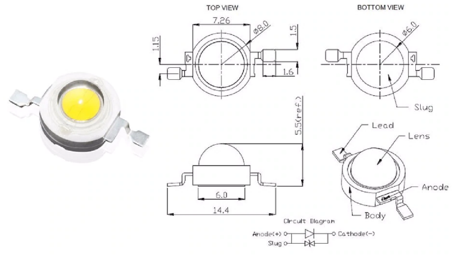
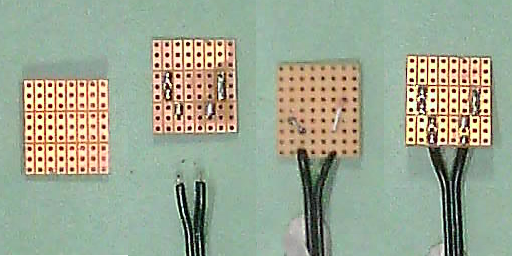
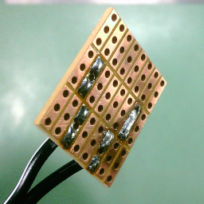
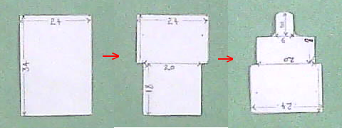
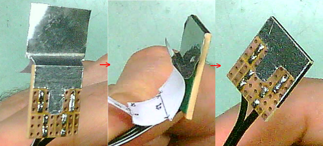

PUMA Project: LED Pad Specifications and How To Guide
=====================================================

This project is released under the following licenses:

For source code (including CAD files, STL files and computer programs) and compiled code: the GNU GENERAL PUBLIC LICENSE Version 3

For documentation: the GNU Free Documentation License, Version 1.3

Introduction
------------
The LED Pad is a simple custom electronics connector board that allows a surface mount LED of the type used in the PUMA microscope to connect to the cable that brings it power. This board also allows that LED to connect by sinple surface pressure alone - no soldering of the LED connector tags are required - so if an LED 'blows' or you want to switch to a different LED (e.g. switch between white light and fluorescein stimulating blue light) you can easily do this without soldering.
The LED Pad is made from standard tripad electronics prototyping board that is cut to size  - no PCB printing or etching or drilling is required.

Required Components
-------------------
* Tripad electronic prototyping board
* Aluminium sticky-back foil (or similar, e.g. copper tape)
* Thermal transfer paste
* Solder
* Track connecting wire: Single core wire that can be soldered and that can fit in the prototyping board's holes.
* Insulated power cable  50 cm long. Two connecting wires in this cable (one for positive and one for ground). There is no need for it to be coaxial or shielded. Speaker figure of 8 cable can be used (outer dims ~2.2x4.4 mm, inner core 8 strand copper conductor).
* Phono plug
* Electrical insulation tape.
* Suitable source LED. Dimensions diagram shown below. These are 1W LED 8 mm diameter round ceramic body surface mount COB with polycarbonate dome. The round body has flattened sides to 7.26 mm and a 6 mm flat heat conducting base pad. Either daylight/pure white or 460nm blue types are used (for standard illumination and fluorescein fluorescence illumination respectively):
	White: Dominant wavelength colour temperature range is 6500-7000K. Voltage range 3.2 to 3.4 V. Brightness rating 100-110 lumens.
	Blue:   Dominant wavelength range is 460-465 nm. Voltage 3.2-3.6 V. Brightness rating 15-25 lumens.

	

Tools
-----
* Wire cutters and wire strippers
* Long nose pliars
* Soldering iron, sponge, stand and fume extractor
* Tools to cut tripad board to size
* Scissors, ruler and pencil.
* About a 3 cm length of 1.75 mm PLA filament (or some similar implement that will be used to apply heatsink paste to surfaces).

Procedure
---------
* Solder / connect the phono plug to one end of the power cable and strip the opposite bare ends by 2 mm or so and tin them.

* Cut a rectangular piece of tripad board consisting in 3 tripads down by 8 strips across (see picture below). The final size will be about 20 x 22.5 mm. File or sand down the edges so that the board will fit well into the recess in the 3D ptinted LED cover without being overly tight (part: DI_LED_Cover.stl).

* On the copper side of the board tin the tripads in the middle row which are 1 strip in from the edge stips (as shown in the figure) and from the non-copper side cut and solder the single core wire such as to connect those two tinned tripads to the tripads below them which are each one strip further towards the centre (as shown).

* Connect the power cable tinned ends to the two holes of the lower tripds closest to the lowest edge of the board as shown in the figure below. The pictures indicate polarity - the wire with the white stripe is connected to the central pole of the phono plug. Ensure this polarity is preserved.

* Ensure no wires protrude from either side of the board. If the tinned middle row tripads are uneven in terms of the thickness of tinning solder then file or sand them down to be level with each other and no more than 1 mm in thickness of the tinning solder (preferably less than 1 mm).

* Cut a square of electrical insulation tape and apply it over the wires on the non-copper side of the board so as to avoid these being cross-circuited by the subsequent application of the heatsink conducter.

* Make the heatsink conducter pad from a 24 x 34 mm piece of the self-adhesive foil as shown in the pictures below (all measurements are in mm).

* Apply the heatsink conducter pad as shown below taking care not to cross circuit the two central tinned tripads to each other.

* When ready to fit the board to the LED holder and LED apply heat transfer compound to the heatsink area of the LED and board using your applicator before attaching the board to the LED.

PJT

First written: 01.03.2021 

