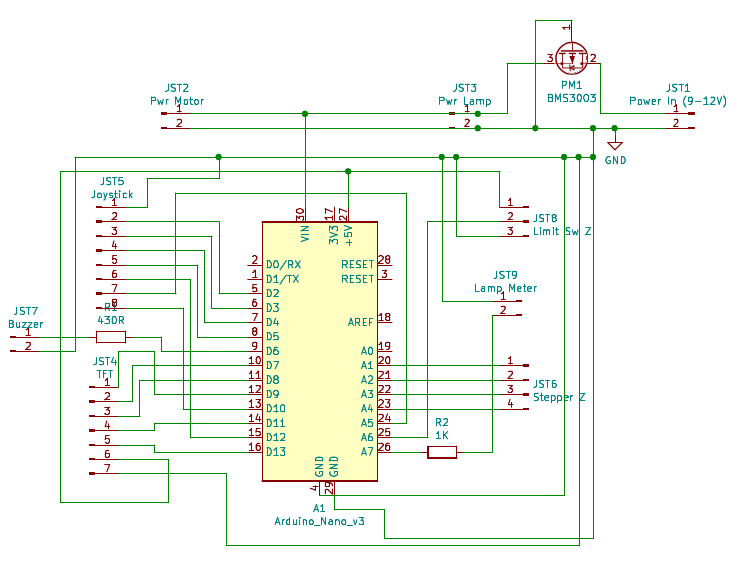
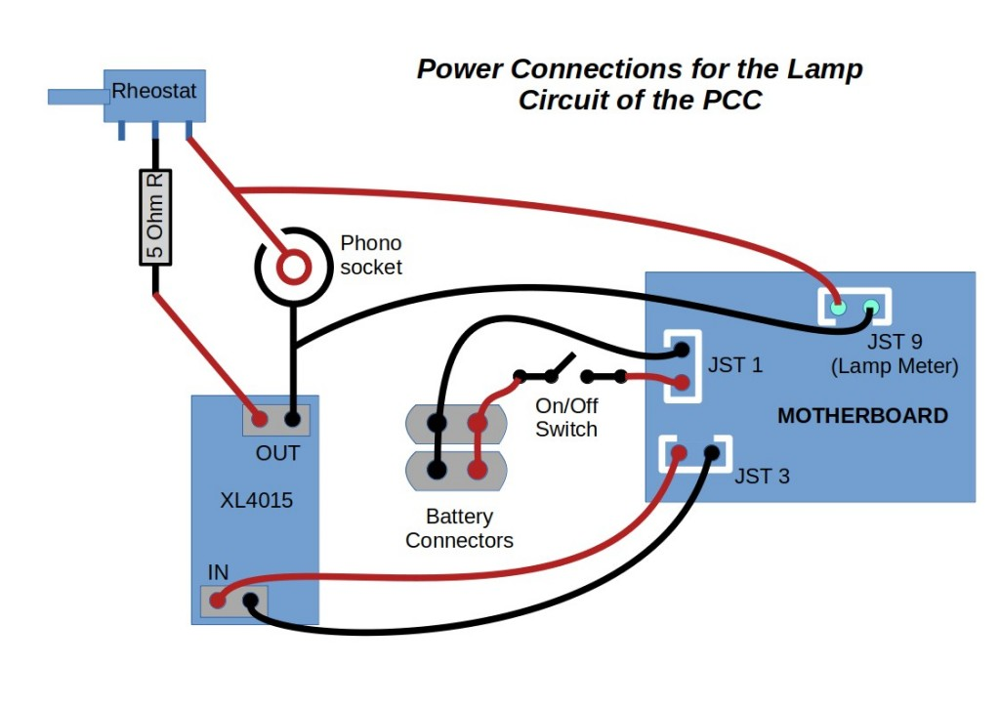
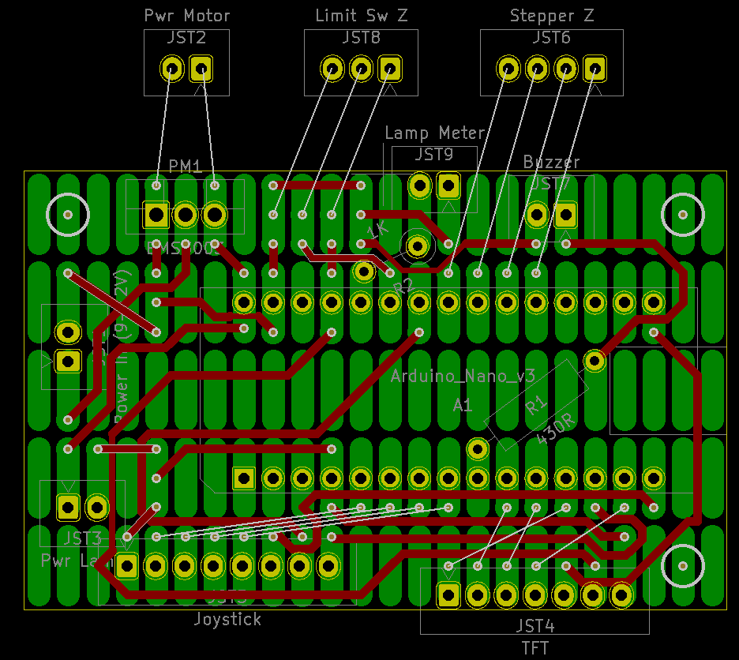
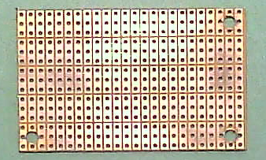
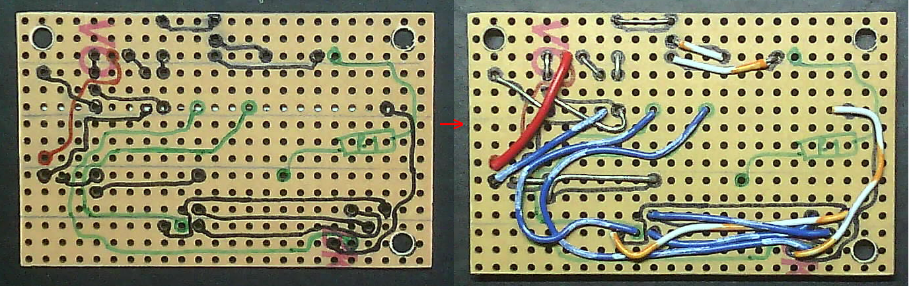
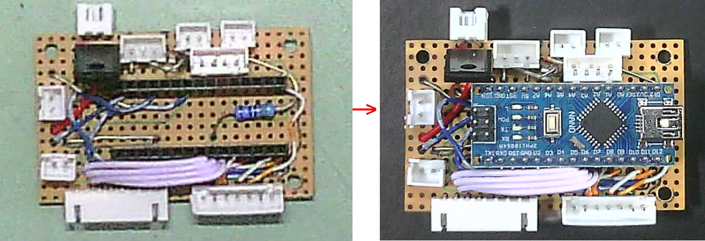
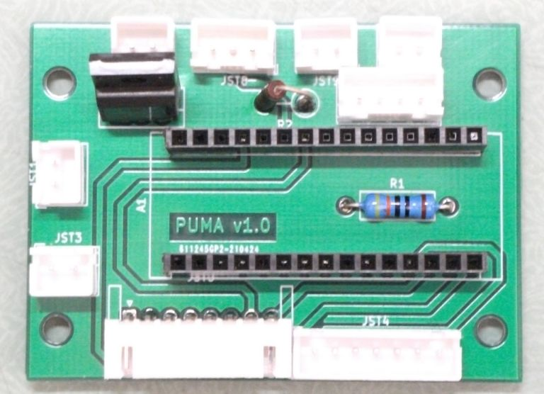
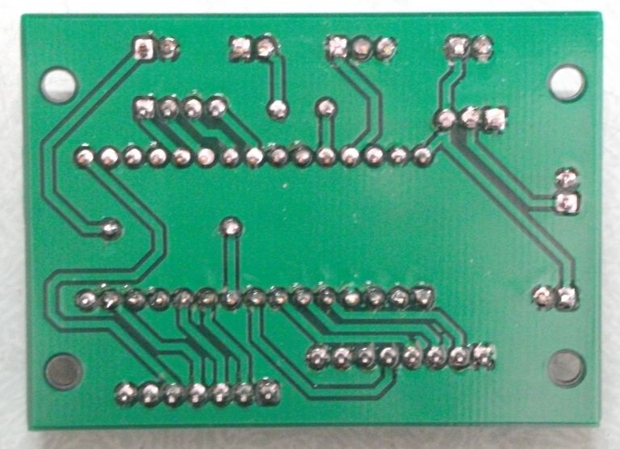
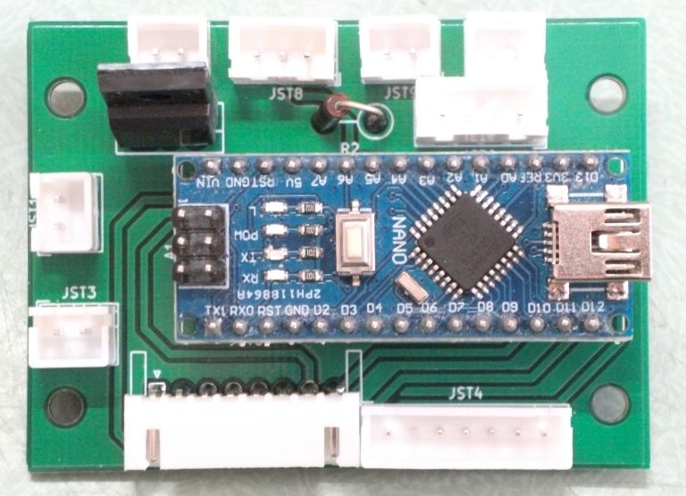
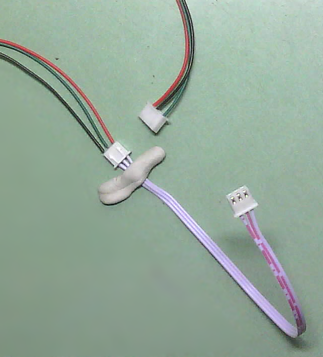

PUMA Project: Motherboard Specifications and How To Guide
=========================================================

This project is released under the following licenses:

For source code (including CAD files, STL files and computer programs) and compiled code: the GNU GENERAL PUBLIC LICENSE Version 3

For documentation: the GNU Free Documentation License, Version 1.3

The professionally printed motherboard PCB is now available for purchase from the OptArc store here https://www.optarc.co.uk/products/other-components/

Introduction
------------
The PUMA motherboard is an essential component of the PUMA Control Console (PCC) - the device which lets the user control the Z-motor, lamp brightness and TFT displays of the spatial light modulator (SLM) and heads-up-display (HUD).
The motherboard houses the Arduino Nano microcontroller and provides reverse polarity protection for all PCC devices and dedicated IO ports for all peripherals.
A video tutorial was made which shows how to construct the PCC with a ready-prepared motherboard. This How To guide only discusses the construction of the motherboard.
There are two forms of the motherboard:
 1. A DIY form based on ready-made and widely available tripad prototyping board - no printing or etching or micro-drilling required. 
 2. A dedicated PCB design.

The two boards (PCB and DIY) are electronically identical and physically interchangeable. The same circuit diagram applies to both.

Required Components
-------------------
* Tripad electronic prototyping board
* Solder
* Track connecting wire: Single core wire and multicore ribbon cables that can be soldered and that can fit in the prototyping board's holes.
* JST XH PCB connector headers (right angled versions) of the following pin numbers: 2, 3, 4, 7, 8
* 2.54 mm pitch single row female PCB socket pin header connector strip for Arduino. These have an 8.3 mm tall black plastic body. You will need two strips, each with 15 pins.
* P-Channel MOSFET, 78 A, 60 V, 3-Pin TO-220F ON Semiconductor BMS3003-1E
* Through hole resistor: 1K Ohm, 1%, 0.5W, Axial
* Through hole resistor: 430 Ohm, 1%, 0.5W, Axial

Tools
-----
* Wire cutters and wire strippers
* Long nose pliers
* Soldering iron, sponge, stand and fume extractor
* Tools to cut tripad board to size
* Fine tipped permanent marker pens.
* Drill with 3.2 mm bit

Circuit Diagram
---------------

Power Connections
---------------

Procedure for the DIY Motherboard
---------------------------------
* In the following instructions refer to the below diagram for wiring and placement of components. The diagram is a view from the top / component / non-copper surface. The copper tripads are shown in green as if the board were transparent. Wiring and connections are shown either as thick red lines or thin white lines:

* Cut a piece of tripad board 5 tripads down by 24 strips across (this comes to about 37 x 61 mm) and enlarge the three corner holes with a 3.2 mm diameter drill bit as shown in the figure below. 
 

 
* Turn the board over to the non-copper side and mark which pads need interconnecting wires as per the above circuit diagrams. Then proceed to solder linker wires to connect them as in the below picture (wiring is incomplete in the picture and there are some errors so don't copy this picture exactly - be guided by the above wiring schematics).

* Next solder in the remaining components and finally insert the Arduino Nano.

* Once the PUMA Control software is loaded onto the Nano you should test it all works with the required peripherals (see the PUMA Control Console specification in the PUMA GitHub repository for specifications as to the required peripherals).

Procedure for the PCB Motherboard
---------------------------------
* This is best made by a professional PCB manufacturing service (as shown below).
* The board edge cuts measure 60.96 mm by 44.45 mm so it is slightly larger than the DIY tripad version but the holes are in identical spacing between the two versions and they are interchangeable in the PUMA Control Console (either will fit).
* Make or otherwise obtain a drilled double-sided PCB with the specifications contained in the documents in the KiCAD folder of this repository.
* Solder the components in their places (if not already done for you) and test.

Making the Custom Limit Switch Cable
------------------------------------
The limit switches used as part of the motorised Z stage kit come with a 4 pin JST XH connector cable. However they only have three active connections and so only three wires are conveyed with one of the 4 pins of the limit switch JST connector unused. To save space on the motherboard a 3-pin JST header is used. So there is a need to convert this 4-pin connector cable into a 3-pin cable at one end. To do this, cut off the 4 pin JST connector from one end of the limit switch connecting cable and strip the cut ends of the wire bare for a few mm then tin them. Insert the wires into one end of a double-headed 3-pin JST cable in the manner shown in the below figure and fix them in place with a method of your choice (simple electrical insulation tape will work).

 

PJT

First written: 02.03.2021 
