PUMA Project: PUMA Lite Control Box How To Guide
================================================
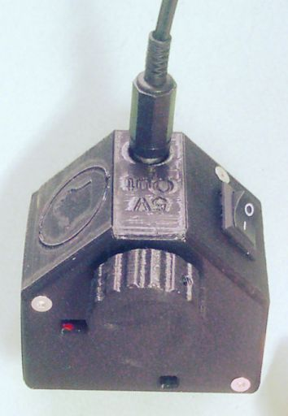  
This project is released under the following licenses:

For source code (including CAD files, STL files and computer programs) and compiled code: the GNU GENERAL PUBLIC LICENSE Version 3

For documentation: the GNU Free Documentation License, Version 1.3

Introduction
------------
The PUMA Lite controller (PL) is the device which powers the microscope lamp (only). If you require additional control features (such as the focus motor or AR projector) then you will need the more complex 'PUMA Control Console' (PCC) which does these other things in addition to powering the microscope lamp. The PCC has its own 'How to' guide on this GitHub repository.
The PL can power and control any of the PUMA lamps - for white light or fluorescence - because the different LEDs used for these purposes are electronically cross compatible.

:warning: Safety Warning :warning: 
--------------
This project uses a high current power regulator and power supply. Making wrong connections or failure of components or misuse can cause fire, burns injuries, battery damage (explosion, fire or corrosive chemical leakage) and permenent damage to components and equipment. Only attempt to make this project if you have sufficient electrical enigineering experience or supervision. 

Required Components
-------------------
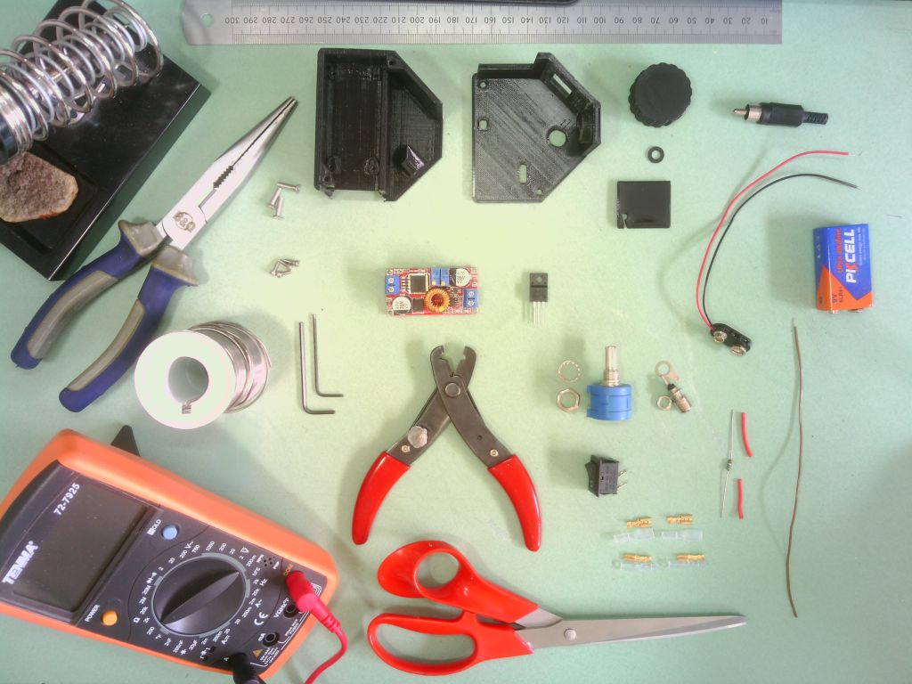
* The following 3D printed parts as specified in the 'PUMA_3D_Printing_Guide':
    > All parts in the chapter 'PUMA Lite'
* The following pre-assembled PCBs:
    > XL4015-based DC-DC step-down buck converter module with both current and voltage regulation of the type shown in the below picture.
    
    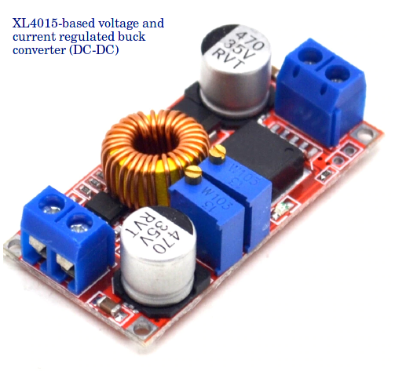
* Solder
* Phono socket panel mount type (and a phono plug to assist fitting the socket).
* P-Channel MOSFET, 78 A, 60 V, 3-Pin TO-220F ON Semiconductor BMS3003-1E
* Through hole resistor: 5 Ohm, 1%, 1W, Axial
* Precision potentiometer 200 ohm: Wire wound, bushing mount, Bourns 3590s type.
* ON/Off rectangular rocker switch, 10A/125V or 6A/250V, SPST type. Dimensions: Flange (2.05 cm x 1.5 cm), body size (1.8 cm x 1.15 cm) with 0.48 cm wide connector lugs. Switch body height below flange 1.05 cm and connector lug height 0.85 cm.
* One 9v PP3-type battery snap connector with 150 mm long leads.
* A power supply: Either a 9v battery (type 6LR61 PP3) or a mains regulated power adapter that can put out 9 volts regulated DC (actually anything between 8 V and 36 V will be acceptable) and at least 300 mA of current with a PP3 connector.
* Solderable spade connectors with insulator covers of sizes 4.8 mm and 2.8 mm (widths). You could forego these and solder all connections instead as an alternative. Particularly it may be advantageous to solder the leads to the potentiometer lugs as these are the ones most likely to fall off by accident.
* Scissors, screw driver, long nose pliars, some insulated wire and wire strippers

Additional Peripherals Required for Testing
-------------------------------------------
* A PUMA microscope LED lamp module

Fixtures and Fittings
---------------------
* All screws are of Allen socket type and made of stainless steel
* The case screws are countersunk. All other screws are socket cap screws.
* The number and type of screws used for each component are given below starting with the component they are to be used for. Lengths refer to the length of the threaded part of the screws (i.e. it does not include the head / socket).
* Case screws: 3x M3, 12 mm long
* Power board: 4x M2, 6 mm long

 
Tools
-----
* Wire cutters and wire strippers
* Long nose pliers
* Soldering iron, sponge, stand and fume extractor
* Allen keys (2 mm and 2.5 mm)
* Small Philips head screwdriver
* Multimeter with voltmeter and ammeter capabilities (to more than 1 amp tolerance)

Assembly Procedure
------------------
* Pre-thread all holes in the casing that are designed to take the thread of a screw. Don't go all the way in and be especially careful of the shallow holes on the front panel otherwise you could deform the external surface or go all the way through with the screw.
* Bend the pins of the p-MOSFET as shown in the figure. The middle pin is bent right back and the other two pins are bent and turned to line up so that they fit into the input terminal block of the buck converter as shown. The negative pin will need to be cut short by a few mm to allow this.

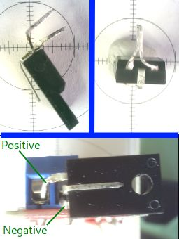

* Take the PP3 connector and wrap the negative lead end around the negative pin of the p-MOSFET as shown in the figure (no need to solder it to the pin). To the positive lead of the PP3 connector solder a 4.8 mm spade connector. To the middle pin of the p-MOSFET solder a wire that has a 4.8 mm connector at its other end. You can then insert the p-MOSFET into the buck converter input block and connect the spades to the on/off switch. Finally, connect the 9V battery to the PP3 connector. The buck converter can now be powered up by turning the switch on.
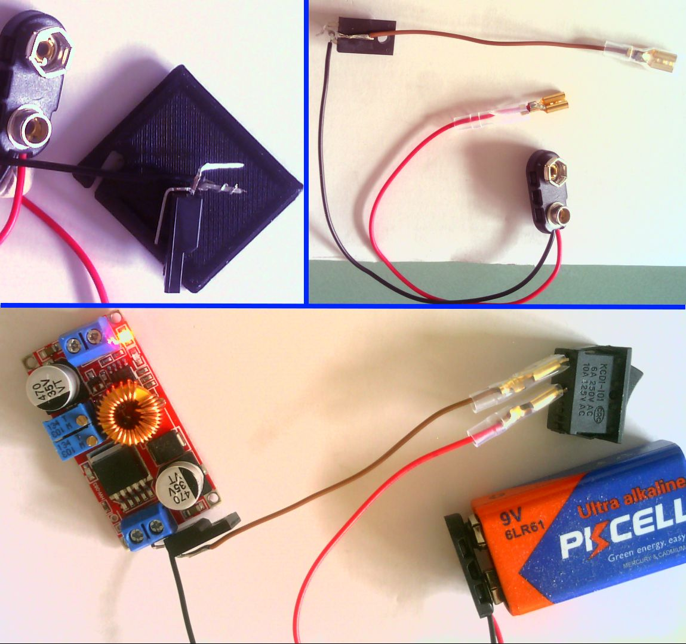

* At this stage,with the buck converter powered on, you should adjust the trimmer potentiometers on the buck converter to ensure the correct current and voltage regulations are set (see figures below).
* To set the correct current set your multimeter to measure current in the range of 20 Amps DC, place the meter probes on the output terminals and adjust the trimmer potentiometer closest to the output side of the board until a reading of 0.33 A is achieved. Note that the LED nearest the battery input terminals must be lit during this procedure to indicate that the board is limiting the current (as shown in the picture). If it is not lit, disconned and reconnect the power (using the on/off switch) and try again.
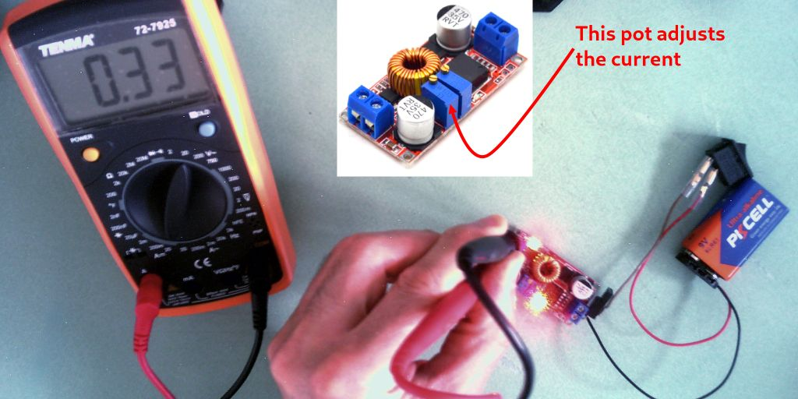

* To set the correct voltage set your multimeter to measure volts (20 V DC range), place the meter probes on the output terminals and adjust the trimmer potentiometer closest to the input side of the board until a reading of 5.0 V is achieved. The buck converter board can now be powered down and the on/off switch disconnected from the spades.
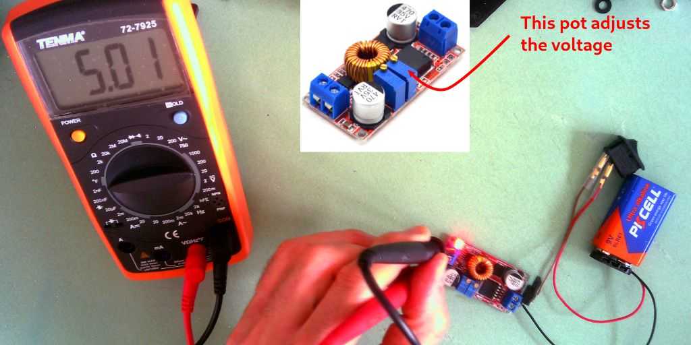

* Now create the three cables you will need to connect the output side of the buck converter board to the lamp brightness potentiometer and output phono socket (see picture). The shortest cable (~ 5cm) has a 4.8 mm spade at one end and a 2.8 mm spade at the other - it will be used to connect the brightness potentiometer to the phono socket centre terminal (positive). The second cable has a 4.8 mm spade at one end and a bare end - this connects the negative terminal of the buck converter directly to the negative / ground terminal of the phono socket. The third cable is made of the 5 Ohm resistor and a piece of wire with a 2.8 mm spade at the end of the wire and the other end of the resistor is just bent into a small loop - the looped end of the resistor will fit into the positive output terminal of the buck converter and the spade end will eventually go to the potentiometer.  
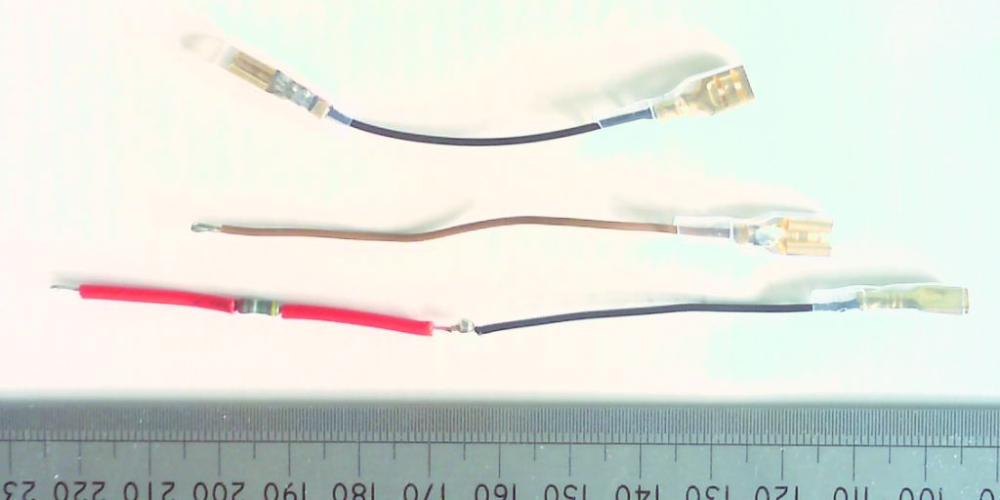

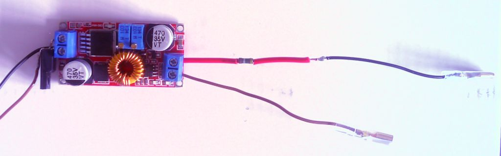

* The buck converter can now be secured in the main body of the casing with the 4 M2 screws as shown.
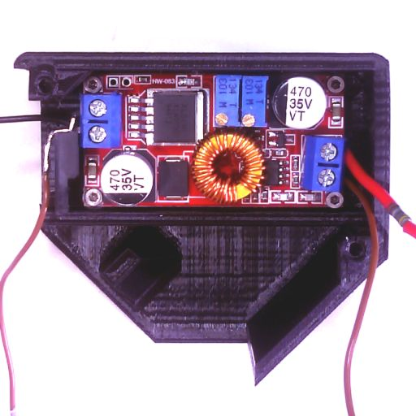

* Now prepare the front cover part of the casing by inserting the connectors as shown in the below figure starting with the potentiometer, then the phono socket (having a phono plug inserted into the socket while fitting it will ensure good clearance of the socket from the walls of its receptacle) and finally the on/off switch is pushed into its rectangular hole with the bent spades pointing towards the top cover as shown. The small connector cable can then be used to connect the end connector of the potentiometer to the central connection of the phono plug - note that the small 3D printed plastic washer goes over the central lug of the phono socket prior to connecting the spade connector of this connecting cable (parts C and D of the fingure below).
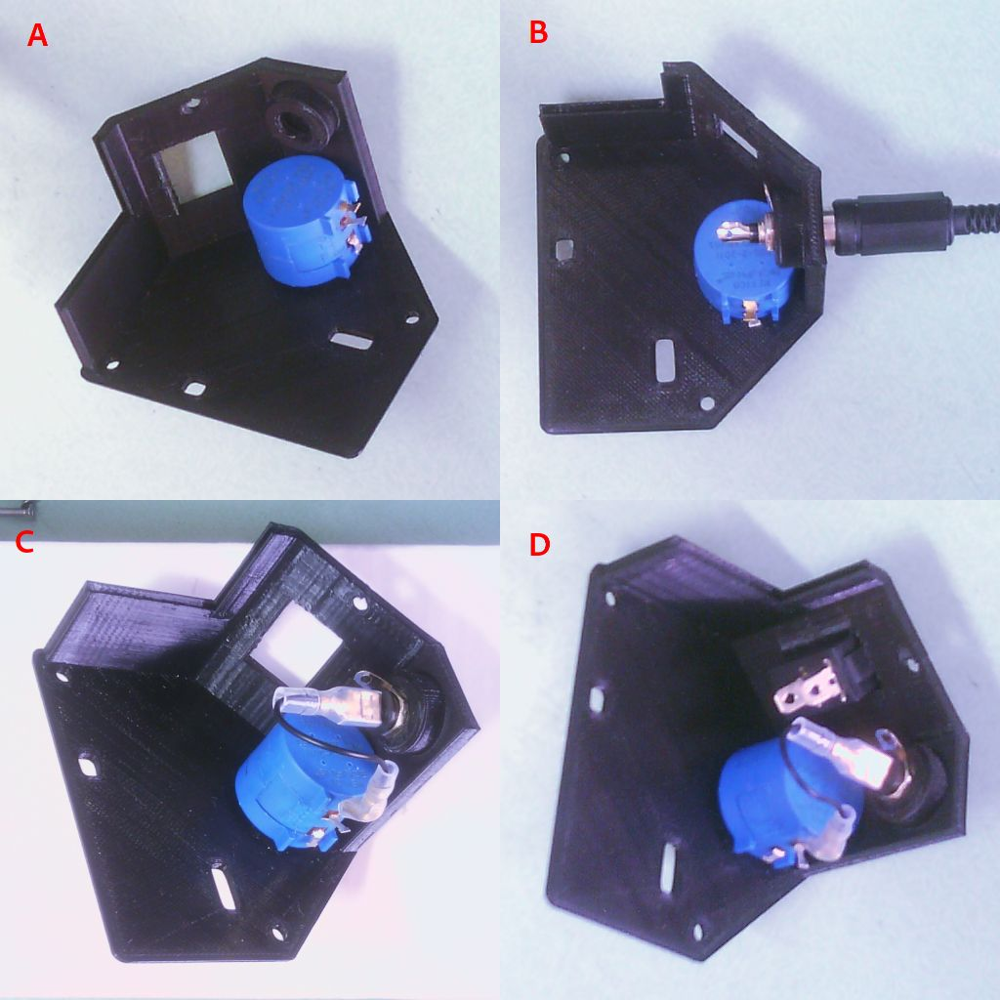 

* Connect the output cables from the buck converter to the phono socket and central lug of the rheostat as shown in the figure below.
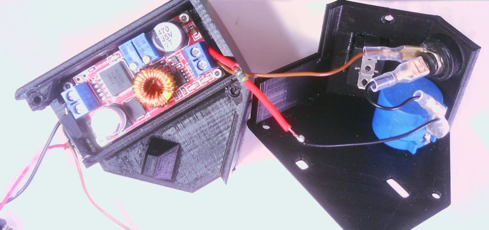 

* Now connect the spades to the on/off switch and ensure that the battery connector leads are fit into the notch in the side wall of the casing as shown in the figure below.
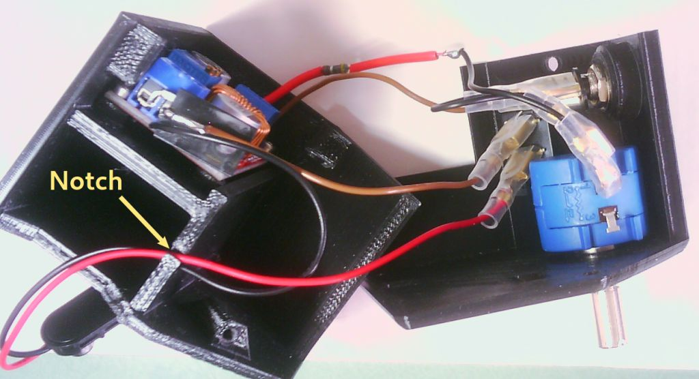 

* Now fit the cover to the main casing, attach a battery, put the battery into the battery compartment and close that compartment with its cover. Put the knob on the shaft of the potentiometer. These steps are illustrated below. Take care to ensure spade connectors don't come loose. You may need to crimp them with the long nosed pliars. Take care also that the battery connector leads remain in the slot in the casing.
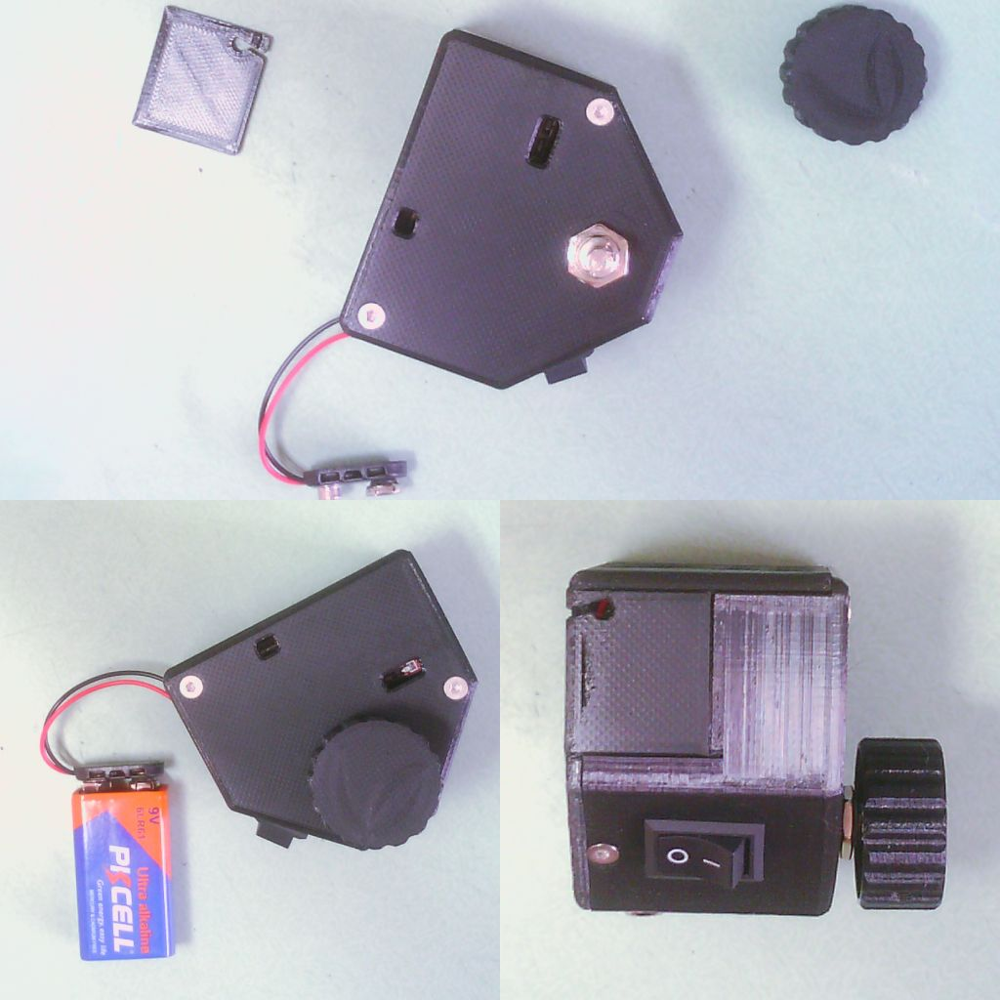 

* The unit is now ready for testing. At first just switch it on without any lamp attached (below figure, insert). The red LED should come on - if it doesn't you will need to double check all connections and components. If the red LED comes on then switch off, attach a PUMA lamp and switch on again  - turn the potentiometer to ensure brightness can be varied. On the latter point note two things:
1. The resistance is increased as you rotate the knob clockwise which means that brightness of the lamp will increased with anti-clockwise rotation and decrease with clockwise rotation.
2. The potentiometer is linear - for many turns you will not notice much change in brightness but there will be anoticeable increase in brighntess for the last few turns anti-clockwise.
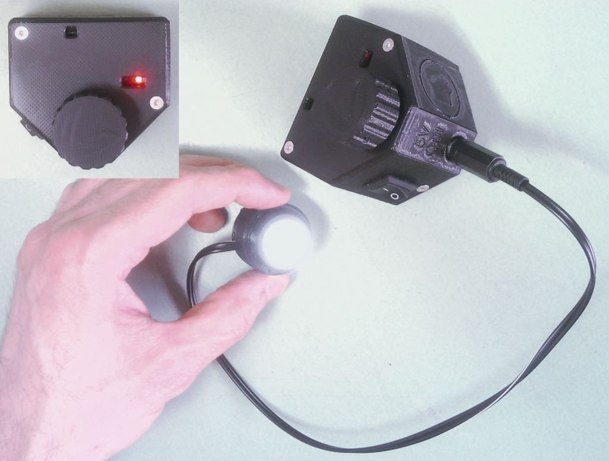 

Tripping the Lamp Power Regulator
---------------------------------
* With the PUMA Lite, tripping the power regulator (as described for the PUMA Control Console) does not appear to be a problem in practice but we use the same fixed 5 Ohm resistor in the circuit for added safety and to make the illumination circuit with the PUMA Lite identical to the illumination circuit with the PUMA Control Console.

Power Consumption
-----------------
The PUMA Lite has no in-built ammeter. However measurements have shown that the output current to the lamp varies from about 10 mA at minimum brightness to about 290 mA at maximum brightness. The holes in the top of the casing allow visualisation of the LED indicators on the power regulator board.
When power is supplied to the power regulator board the LED closest to the output terminals of the power regulator board will be lit. This LED alone will continue to show when the bulb draws current up to about 27 mA. Higher current draw than that will start to illuminate the LED next to it (this just starts to come on at about 28 mA) and when both LEDs are at equal brightness the current draw is about 30 mA. The LED closest to the output terminals of the power regulator board will gradually weaken and switch off when the current draw to the lamp reaches about 32 mA. No change in LED status will be seen as the brightness is further increased but the maximum brightness occurs at a current draw of about 290 mA.
The LED on the other side of the power board will only go on if the current draw reaches 330 mA so this LED would not normally light at any stage.
From a 9 Volt battery the unit will consume about 1650 mW at maximum brightness and only about 185 mW at minimum brightness. The current drawn from the battery will vary between 260 mA and 25 mA respectively. If using a 12V external power supply the current draw will be between 167 and 22 mA.
 

PJT

First written: 07.06.2021 
