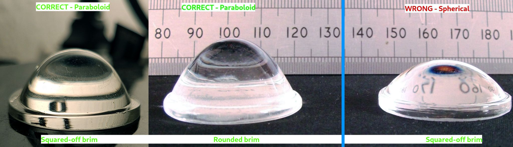

PUMA CAD Files
==============

Introduction
------------
These are the source CAD files for the PUMA 3D-Printable Microscope Project. Note that you will need other components in addition to the 3D printed parts represented here to build the modules. For example, screws and lenses. Details are given the the construction documentation and YouTube videos.

These CAD files were made in FreeCAD v. 0.19 using 64 bit Arch Linux.

For information on how to generate STL files from the models in these CAD files, see the 'PUMA_3D_Printing_Guide' in the 3D_Printing folder on the PUMA GitHub page.

Updates to models that have occurred since the v1.0 release are described in the YouTube videos and some are also described in detail below. Many models have been updated since the v1.0 release so please use the models from the current main branch of this GitHub repository when building any part of PUMA.

At the end of this document therr is a summary of what each file contains is given below. For details about the parts and construction of the microscope see the detailed documentation and tutorials.

Updates to the Abbe Condenser Module
------------------------------------
Since making the video on the Abbe condenser it has come to my attention that there are at least 3 variations of 30 mm lens that are sold by different suppliers (shown in the photos below), not all of which are acceptable for use in the condenser module.

The correct type of lens has the tall paraboloid shape,the shorter spherical lens is not suitable (it has the wrong focal length). However, of the acceptable paraboloid lenses there are two subtypes: one has a base brim with a curved edge to it and one has a base brim with squared off edges. These two require slightly different model parameters to fit well into the DI_Condenser_23_30 housing.
I have modified the condenser 23 30 model to have a 'spring-loaded' receptacle hole for the 30 mm lens which now accommodates any of these lenses and which should also compensate for any slight differences in tolerances between printers and between lenses. The new model also has ejection ports which allow the lenses to be removed and resited without damaging the print.
The previous fixed hole size models have been deleted.
I have also updated the condenser base so as to have a diaphragm which makes it easier to insert IAD filters without undue force (including the delicate electronic TFT screen-based SLM). The condenser attachments for the mirror suspend socket and upper collector have had their top threads truncated by 0.5 mm to ensure they don't protrude on this new aperture diaphragm and impede the insertion of IAD filters.
If you have already successfully built a condenser and have no problems inserting IAD filters then there is no need for you to update anything - the optics of the previous and new versions are not significantly different. If you find you are having problems inserting IAD filters then you may want to swap in the new DI_Condenser_base and use the new DI_Cnd_to_UC / DI_Cnd_mirror_holder_socket connectors as it may help with that.

Summary of Each File
--------------------

**AR_Projector**

 The augmented reality projector used to provide a heads-up-display.
 
**Binocular_v3.1**

 Parts required for the binocular head module of the microscope. Only parts specific to the binocular attachment are in this file. The binocular head module also uses some parts that are common to the monocular head attachment which are not duplicated here - see the file 'Monocular_v1.1' for those common parts.
 
**Dominus_v3**

 The Dominus Illumination System. This includes the parts required for the various illumination options and modules of the microscope.
 
**FilterBlock_v2.1**

 These are the parts for that segment of the optical tube of the microscope that goes between the objective quick release receptacle and the ocular head module. It includes two options - a simple filterblock and an advanced filterblock. The simple one has space for two slider filters only. The advanced module has space for 3 slider filters, an optional infinity optics tube lens and a beam splitter / beam joiner cube to allow for epi-illumination, fluorescence, and use of the AR projector.
 
**Focus_Gears**

 The parts needed to make and assemble the geared timing-belt driven Z-stage focus mechanism. Any parts specific to the motorisation option are found in the 'Z_Motor' file, not here.
 
**Legs**

 The various legs used to support the scope in its various configurations.
 
**Monocular_v1.1**

 Parts for the monocular head. This includes ocular mounting parts that are common to all ocular configurations - monocular, binocular and trinocular.
 
**PUMA_Control**

 Parts for the main PUMA Control Console.
 
**PUMALite**

 Parts for the simpler PUMA Lite console
 
**QuickRelease_v2.0**

 The objective holder which joins to the main optical tube.
 
**Stage**

 The main XYZ stage parts. Use this in conjunction with the 'Focus_Gears' to build a complete PUMA microscope stage mechanuism. This can be motorised in Z using the parts from the 'Z_Motor' file (with motor driven by the PUMA Control Console)
 
**Trinocular_CP_v1**

 The Trinocular / Camera Port tube. This connects to the epi-illumination port of the advanced filterblock to provide an outlet for a third ocular port. This file only contains the tube that connects the parts because the remaining parts are found in other CAD files. For example the 90 degree ocular lens holder is found in the Binocular CAD file. Details of what parts are needed and where to find them are given in the detailed construction documentation.
  
**XY_Stabiliser**

 This is an optional add-on that makes the XY slide mechanical calipers more stable i.e. less prone to wobble and lift. It is not always necessary.

**Z_Motor**

 These are the components required to connect a motor to the microscope stage for motorised focus / Z-motion.
 

PJT 25.02.2021
