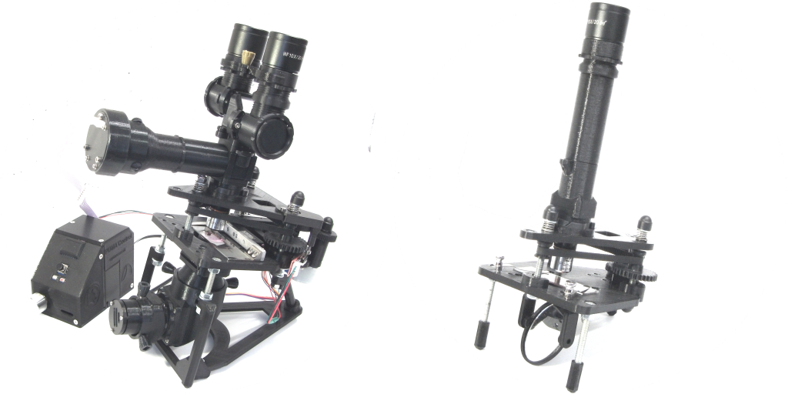
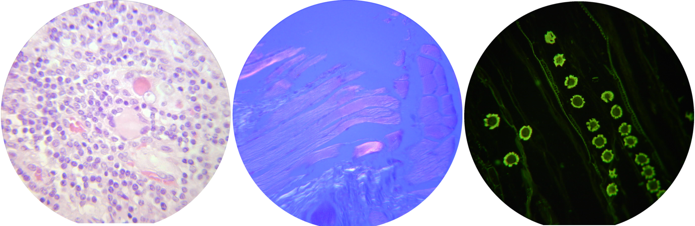
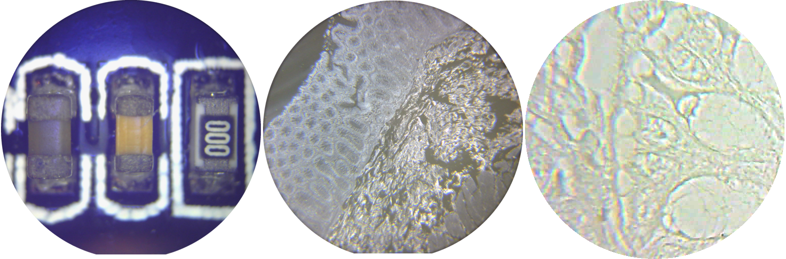
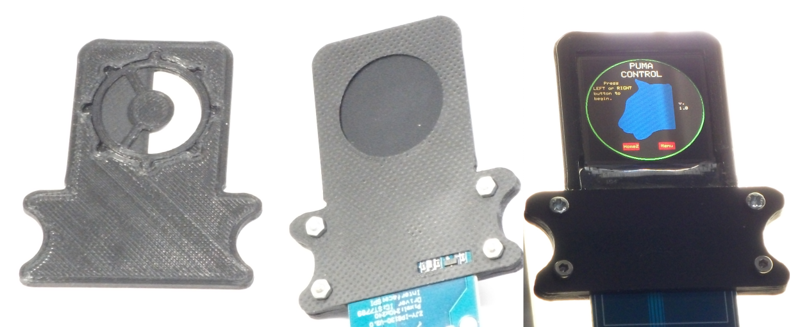
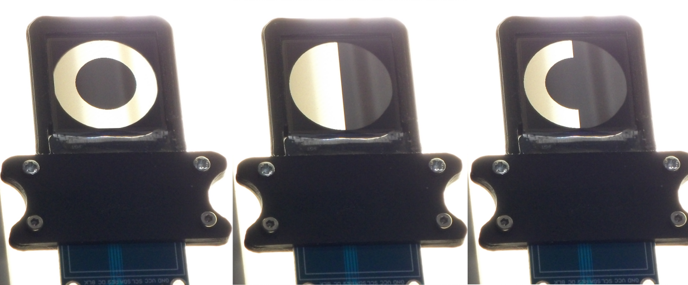
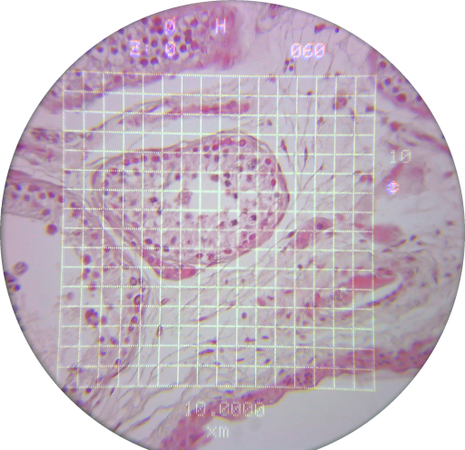

PUMA 3D PRINTED MULTIMODALITY MICROSCOPE 
========================================

This project is released under the following licenses:

 For source code (including CAD files, STL files and computer programs) and compiled code: the GNU GENERAL PUBLIC LICENSE Version 3
 
 For documentation: the GNU Free Documentation License, Version 1.3
                       
Intro:
------
PUMA is an Open Source (GPL v3.0) 3D printed light microscope system designed for direct eye observations and ultra-portability with advanced options for digital imaging, measurements and computer control. The name PUMA is an acronym of some of its most important distinguishing features: [P]ortable, [U]pgradeable, [M]odular, [A]ffordable

As a professional medical Pathologist I have had the privilege of usng high quality optical microscopes routinely. I know what a great optical image they provide, how comfortable they are to look down and also how horrendously EXPENSIVE they are to buy and maintain putting them beyond reach of most people. I designed the PUMA scope to make such a high quality optical viewing microscopy experience available to people without such generous funding resources.

Most 3D printed open source microscopes I have seen appear to be either toys or designed to be used as camera scopes with a web-cam / PiCam or smartphone. They also seem to be novel re-inventions of the microscope that would seem unfamiliar to people used to a traditional scope - that doesn't mean they are not useful in their own way of course.

PUMA is an open source 3D printed traditional-style direct vision microscope designed as a professional benchtop microscope of familar design but made with inexpensive materials and 3D printing - and made truly portable for field work. Here are its main features:

* It can use professional quality standard microscope optics
* It is truly portable (no mains, smartphone, PC or monitor required).
* It is a multi-modal scope with options for: bright field, fluorescence, dark ground, epi-illumination, polarisation and phase contrast. 
* It has advanced options not usually found on even expensive lab research scopes such as an augmented reality heads-up display and a computer-controlled spatial light modulator for optical Fourier filtration.
* It is not restricted to using a camera, computer and screen for observations (although these may all be used, if desired).
* It is designed to be easily used by those already familiar with standard bench-top microscopes - PUMA does NOT seek to 're-invent' the microscope.
* It is designed to be fully DIY for those who want to have the greatest cost savings - and only uses widely available standard parts.

Example Images from PUMA
------------------------
The pictures below were taken with a wide field camera ontop of an eyepiece to show the whole field of view (except that the last image is cropped). The first row from left to right shows: Bright field Kohler illumination x100 oil immersion objective H&E (chronic inflammation), trans-polarisation through crossed polars x40 objective H&E (striated muscle of tongue), epifluorescence x40 objective fluorescein stain (*Soncus* flower bud and pollen grains). The bottom row from left to right shows: Epi-illumination through crossed polars x4 objective (circuit board), dark ground microscopy x10 objective unstained section (colon), Schlieren phase contrast x100 oil immersion objective using the spatial light modulator (colonic crypt cells).

Advantages:
----------

PORTABLE: PUMA is totally portable. Not only is it small and lightweight but it does NOT require a computer, smart phone, camera or PC monitor to operate. It does have advanced options including an in-built computer and motorised Z-stage but even those options are driven by a small dedicated battery-operated control console. There is no need to plug into the mains. Solar powered battery chargers can be used to keep standard batteries topped up (AA and 9V batteries can be used). So PUMA can be used for extended periods in remote places without mains electricity and without internet connectivity. It can be quickly 'field-stripped' for transport without tools and likewise reassembled. There is also the option to use a mains power adapter if full portability is not required.

UPGRADEABLE and MODULAR: Like many professional series of laboratory microscopes, PUMA is modular. You can use it as a simple - but high  quality - monocular microscope with an adjustable mirror for illumination (so not requiring any electronics at all) - all the way through to an all-singing, all-dancing trinocular scope with full Kohler illumination and an augmented reality unit for a heads up display of its integrated computer allowing for digital measurements and much more - while still being fully portable. Many other configurations are also possible e.g. epi-illuminated, fluorescence, dark ground, polarisation, etc. However, PUMA uses the concept of modularity to enhance its role as a standard benchtop observational microscope and to make it possible to upgrade without duplicating existing 3D printed parts and to switch modalities with the greatest ease and simplicity. No attempt has been made to make PUMA a general optical bench. 

AFFORDABLE and OPEN SOURCE: All aspects of the PUMA are open source and not monopolised behind paywalls and patents. As a 3D-printed project it is designed to be built and customised by anyone with access to 3D printing  and uses standard fixtures and fittings that are available form a variety of retail outlets like Amazon, Ebay and AliExpress. Even the high quality optics can be purchased inexpensively form these general outlets - you don't need to buy any component from a specialist university optics supplier or a major microscope manufacturer to get a professional quality optical experience.

DIY: Great care has been taken in the design to ensure the whole scope with all its advanced options can be built by anyone with standard tools and only moderate DIY skills. There is no need to print/etch/drill custom circuit boards and only standard fixings are used - screws and washers that can be purchased cheaply almost anywhere. Even the most advanced optional electronic components can be made with just basic soldering skills and tripad prototypintg board. A single Arduino Nano is used as the basis for on-board computing.

RMS STANDARD: The scope accepts RMS standard objectives so you can use very high quality optics such as objectives from the Olympus BH series or old Zeiss / Leitz objectives that can be purchased second hand on eBay or can be found spare in many labs now that most microscopes have gone over to infinity optics.

INFINITY OPTICS: PUMA works best with 160 or 170 mm tube length objectives. With the addition of an inexpensive tube lens more modern infinity objectives may also be used - although the image quality will not be so good due to the proprietary nature of the corrections used in such objectives. This infinity option is therefore provided, but not recommended.

HIGH EYEPOINT OCULARS: Some other 3D printed micrscopes were designed to be used with camera, computer and display screen to produce an image - if they use a wide field ocular it is mostly so that they can place a smartphone in front of it rather than it being positioned ergonomically for a human eye. The PUMA is designed as a direct vision scope which will take standard professional quality high eyepoint eyepieces to allow clear and wide angled field of view even for spectacle wearers. This allows the user to instantly access the widest possible field of view and highest possible resolution in a portable design that is ergonomic for a human observer. For scopes that are dependent on cameras the image size and quality is limited by the size and quality of the available camera chip and computer screen. To get an equivalent large wide angled quality view with a camera scope, you would need a very large monitor (so not portable) and the resolution and colour would never be as good as direct human vision.
PUMA can be used in monocular (standard and ergonomic variable angle options), binocular and trinocular modes. As a first for 3D printed scopes, PUMA also has a live 'double-header' mode so two people can look down the scope simultaneously for live discussion / teaching - without the need for a camera / monitor system. PUMA was designed for human observers to look down the tubes - this was a primary design objective - not an optional afterthought.

CAMERA OPTIONS: Of course PUMA has the option of attaching a camera if you like - in fact you can attach upto 3 cameras simultaneously - so as to provide all the benefits of digital imaging, recording and broadcasting - but this is an option, not a necessary or prime requirement to use the scope. Furthermore the type and make of camera is not restricted. Any camera that can mount on a standard professional laboratory scope can also be mounted to PUMA. So specialist research can be conducted if this requires specialist C-mount scientific cameras. Even smartphone cameras can be used via widely commercially available smartphone to eyepeice adapters. The PUMA specification also includes some 3D printed camera designs of its own making use of inexpensive USB camera modules that can easily be programmed via the UVC driver system in Linux (using v4l2), Windows (DirectX) and MacOs computers - and WiFi enabled cameras that can be accessed by smartphone apps.

HIGH QUALITY ILLUMINATION: Full Kohler illumination with access to illumiated field and illuinating aperture stops is part of the PUMA standard together with an Abbe-type condenser unit. There are also simpler illumination schemes for those who do not need such high NA imaging. There are also epi-illumination, fluorescence illumination, dark ground and polarisation (both trans and epi) options as well as simple mirror-based illumination. Fourier-plane phase contrast is also possible by condenser aperture shaping (so without the need for special phase contrast objectives and tube phase rings). The illumination system was such a major component of the PUMA project that is was given its own development name - the 'Dominus Illumination System' (or just 'Dominus' for short).

SPATIAL LIGHT MODULATOR (SLM): Unlike many commecrially available professional scopes - whose condenser aperture can only be opened and closed in a circular pattern or use a central blocking spot for darkfield mode - the PUMA has a highly flexible condenser aperture. This can be made to be of any arbitrary pattern using either standard physical aperture templates (see first image below showing the manual filter system on teh left with some 3D printed layered template filters in situ and the TFT-base SLM on the right with its boot-up screen far right) or the PUMA SLM - a TFT 240x240 pixel display unit that can be programed to have any arbitrary pattern on that pixel grid and not limited to black / white all-or-nothing transmission (see second picture below which shows the SLM infront of a striplight with some example apertures for dark ground microscopy and phase contrast). This makes condenser-based phase contrast simple to achieve as well as provide a basis for Fourier ptychography, Fourier tomographic depth scanning and other Fourier optics methods. One can even program the aperture to modulate according to the shape of the specimen currently being viewed to have 'object aware' aperture optimisation.

MORTORISED FOCUS OPTION: There is an option to use a motor for focussing which gives greater stability and accuracing to the focus mechanism.

AUGMENTED REALITY (AR) HEADS-UP DISPLAY (HUD): Another first for 3D printed microscopes (to the best of our knowledge) is the unique PUMA AR projector that allows a digital HUD to be superimposed on the live optical image (see example picture below). This allows many advanced features such as an interactive pointer (useful for teaching and demos), an accurate timer (useful for analysis of live specimen events), the imposition of many custom grids and graticules (for measurements) and scale bars (for teaching and making scientific publication-ready illustrations). The AR HUD also provides for the interactive measurement of line and boundary lengths and particle counts amongst other things. All of this is controlled and powered by the portable battery-powered PUMA Control Console using an integrated microprocessor (Arduino Nano) so no mains power source or separate display screen, camera, frame grabber or computer is needed (as would be the case for other microscopes that may provide such digital interactive measurements). A reason why PUMA may be the first in having an AR HUD option is that other 3D printed microscopes to date have been designed primarily as camera scopes rather than direct vision copes.
Specialist HUD AR units have been designed and are commercially available for standard lab microscopes such as Zeiss and Olympus but these cost many thousands of pounds just for the adapter, let alone the scope, putting them out of economic reach of most people and they are certainly not portable.

EDUCATIONAL VALUE: Being open source and 3D printed, together with its standard traditional upright optical design, PUMA also serves as an educational asset to those interested in learning the optics and physics of compound microscopy as well as those wishing to customise and experiment with the optical path of a microscope e.g. to develop novel imaging modalities and perform bespoke imaging experiments. This would be much harder or more expensive to do with a current commercial scope from one of the major professional microscope manufacturers. The design principles developed for PUMA can also be educational in instructing and inspiring those wishing to develop more general 3D printed optical instruments. Thus PUMA has a wide educational reach even beyond those making direct microscopical observations.

STURDY Z-STAGE: The PUMA Z-stage is based on the thread and timing belt mechanism used by 3D printers themselves. This allows it to move the whole above-stage heavy optical assembly very precisely (something that flexure-based 3D printed stages are not currently capable of).

STANDARD XY STAGE: The PUMA specimen stage is of a familiar design using standard stage clips or an standard XY mechanical caliper to hold and manipulate a standard microscope slide over its full range of motion (more than 50 x 25 mm). This allows a standard microscope slide to be screened across it whole viewable area as professional biological microscopists will be used to. PUMA makes no attempt to re-invent the microscope stage using 3D printing.

Limitations
-----------

Of course a 3D printed, plastic-bodied microscope will have limitations compared to all-metal precision engineered research scopes. The main limitations of the PUMA scope are:
1. PUMA can only accept one objective at a time. In order to change the objective you must physically unscrew the existing one and screw in the new one - there is no turret mechanism. This is the main reaon why I do not recommend PUMA for routine medical diagnostic use - the image quality is excellent for medical diagnosis but the need to interrupt viewing to change objective is offputting to the concentration required to screen a diagnostic histology slide.
2. Limitations of stability due to lightweight plastic construction. Especially at high magnification (e.g. x40 objective or x100 oil objective) the image will noticeably wobble if the scope or the desk is touched or otherwise disturbed during observation. Also, the focus mechanism displays some elastic backlash. This can be compensated for by varying your focus technique but this can take time to get used to for those who are used to the smooth focus of precision metal milled rack-and-pinon focussing. The motorised stage option of PUMA helps reduce both these limitations significantly. 
3. Sample size limit. The tripost architecture of the main stage limits the size of specimen that may be examined. There is no problem examining a standard microscope slide (25 x 75 mm) but larger objects such as some larger petri dishes and cell culture bottles may not fit on the stage.
4. The PUMA standard for the illumination system employs off-the-shelf mass-produced inexpensive glass moulded aspheric condenser lenses to build a quite complex optical assembly (i.e. Kohler illuination and Abbe condenser). Because these are not custom designed, precision ground and highly corrected - as you would get with much more expensive lab microscopes - the PUMA Kohler setup is more fiddly to align and not as accurate as with expensive rersearch scopes. Nonetheless the PUMA Kohler system is actually very usable and gives a good clean image to high numerical aperture - including for oil immersion.
5. Although not a limitation of the scope itself, this seems like an appropriate place to emphasise that the optical image quality can only be as good as the quality of the optics used. if you use an Olympus SPlan objective and Olympus WK 10x/20L-H eyepiece (which you can use with PUMA) then you can get the optical image quality of a professional Olympus BH-2 microscope. However, if you use a cheap plastic toy RMS objective costing £5 from AliExpress and a cheap plastic toy eyepeice then you will get the optical viewing experience of a cheap plastic toy microscope.

PJT

First Written: 24.02.2021
